<p align="center">
  
  
  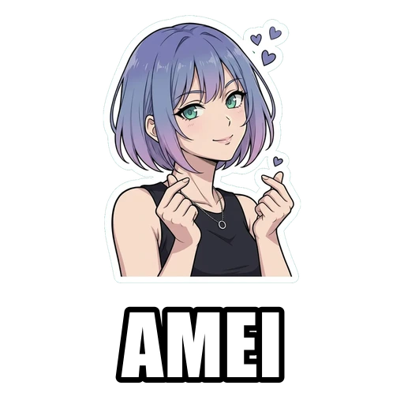
  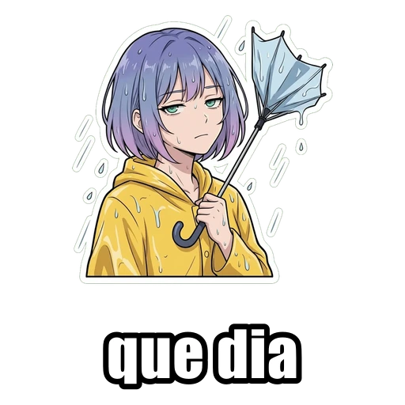
  
</p>

<h1 align="center">Make your own stickers</h1>

<p align="center">
  Open source sticker pack generator for WhatsApp and Telegram.<br>
  You bring the character; the prompt recipe, the cutout, the caption and the pack assembly come from here, by script, for free, on your own machine.<br>
  The 45 above are the template that ships with it: <a href="https://helenai.wtf">Helen INBT</a>, an original character from the <a href="https://inhabitants.zone">INHABITANTS</a> series.
</p>

<p align="center">
  <a href="README.pt-BR.md">Português (BR)</a>
</p>

<p align="center">
  
  
  
</p>

---

## Confused? Let your agent do it

The six steps below exist for people who want to understand the machine. If you just want the pack, you need none of them: copy the text below, paste it into your agent (Claude, ChatGPT, Cursor, Gemini CLI, whatever you already use) and send the character photos in the next message. The kit ships an [AGENTS.md](AGENTS.md) that it reads on its own, and the rest is on it: prompts, generation, cutout, captions, finished pack. You only approve the images.

```
I want a sticker pack of my character for WhatsApp and Telegram.

Use the open source kit https://github.com/inhabitants/stickers: download the repo, read AGENTS.md and follow the recipe in there (prompt with the three slots, chroma green cutout, captions in code, pack assembly).

I will send you 1 to 4 reference images of the character. From those:
1. build the prompts and generate the mood variations
2. run the cutout and show me the 512x512 transparent stickers
3. write the captions on the ones that need them
4. hand me the folder ready to import

Ask me whatever is missing before you start. The images come in the next message.
```

## How it works

Six steps, none of them requires knowing how to program.

**1. Download the kit.** No git, no signup: green Code button, Download ZIP, unzip it into a folder.

**2. Install [Node.js](https://nodejs.org).** LTS version, default install. If your terminal answers `node -v`, you are done.

**3. Generate your character's images.** Use the [recipe below](#the-recipe-open) in any image generator that accepts references. From 1 to 4 references lock the character's face; the background comes out that chroma green on purpose. Save the approved ones in `input/`.

**4. Run the cutout.** The green disappears, each image becomes a transparent 512x512 sticker under 100KB, in `output/`:

```
npm install
npm run cutout
```

**5. Caption and pack.** The caption goes on in code (image models get accented characters wrong). Then the pack: icon and `contents.json` ready to import. WhatsApp accepts at most 30 stickers per pack, so a bigger collection is split into parts on its own, one folder each.

```
npm run caption -- output/01-laugh.webp "LOL"
npm run pack -- --name "My Pack" --author "You" --out packs
```

**6. Install and use.** WhatsApp: a sticker app (Sticker Maker on Android, Sticker Maker Studio on iOS) imports each folder in one go. Telegram: BotFather → @Stickers → /newpack, upload the files (no 30 ceiling there). Your character lives in your conversations.

## The recipe, open

One prompt with three slots and four rules. Swap the character and the expression, keep the rest.

### The prompt

```
Anime cel-shaded die-cut sticker of the exact same character
as in the reference images: [FIXED TRAITS: hair, eyes, skin, outfit].
[THE EXPRESSION AND POSE FOR THIS STICKER].
Waist-up framing, the complete figure sits fully inside the square with a clear
empty margin on all four sides including below. Bold clean black ink outline,
thick white sticker cut border closing all the way around, flat cel shading,
vivid saturated colors. The entire background is one solid flat pure chroma
green (#00E000), perfectly uniform and empty.
```

### What to veto (negative prompt)

```
background scenery, background objects, gradient background,
drop shadow on background, text, letters, watermark, frame, panel,
multiple characters, cropped body, figure touching image edge
```

### The four rules

**01. Chroma green background, always the same one.** Pure green (#00E000) exists to be erased later. Since it appears nowhere in the drawing, the cutout can happen in code, with no segmentation model and no cost. Ask for a flat, uniform background, never a gradient.

**02. Margin on all four sides.** Without a margin at the bottom, the white border does not close and the sticker looks cut off mid-chest. Worth repeating in the prompt and also vetoing "touching the edge" in the negative field.

**03. References are what keep the same face.** Up to four images of the character as references on every generation. That is what makes the stickers look like one person changing moods instead of several similar people.

**04. Text goes on afterwards, in code.** Writing the word into the image makes the model butcher accented characters. Drawing the caption on top later comes out legible, editable, and lets you export the same sticker with and without text.

### The cutout

`cutout.mjs` runs a flood fill seeded from the four edges: it erases the green and stops at the drawing's black outline, which preserves enclosed gaps (the hole between two hands, for example). Two details that cost iteration to find:

- A pocket of background fenced in by the drawing never touches an edge, so the fill never reaches it. A second pass seeds from the inside with a tight tolerance (`--seeds 45`), otherwise green survives in the middle of the figure.
- If your character's palette has any green in it, check the result: a loose tolerance eats the drawing. Tighten it with `--tolerance 45 --seeds 30`.

At the end it normalizes to 512x512 with a 16px margin and exports WebP under 100KB, WhatsApp's ceiling.

## The bundled template: Helen INBT

Proof that the recipe works: 45 stickers of the same character, in [`helen-inbt/com-texto/`](helen-inbt/com-texto/) (captioned) and [`helen-inbt/sem-texto/`](helen-inbt/sem-texto/) (clean), each folder with `tray.png` and `contents.json` ready to import. Use it as a quality reference, as an actual pack, or as remix material (the license allows it). The captions are in Brazilian Portuguese, which is the language Helen speaks.

<p align="center">
  
  
  
  
  
  
  
  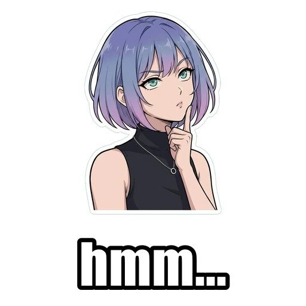
  
  
  
  
  
  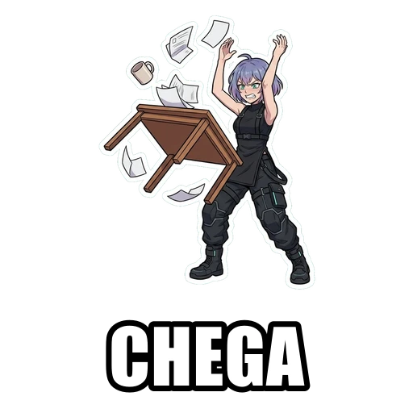
  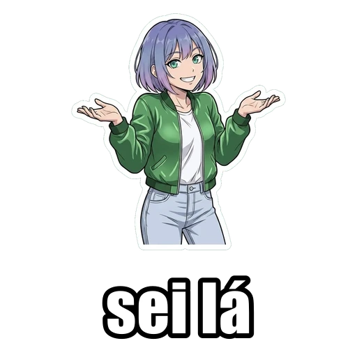
  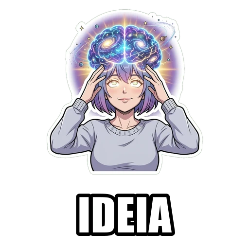
  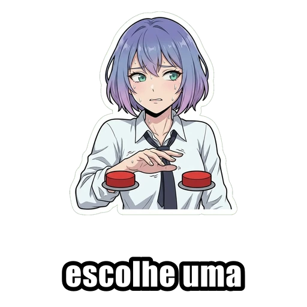
  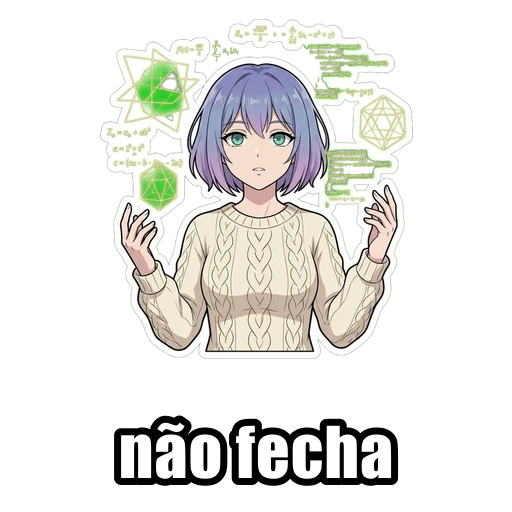
  
  
  
  
  
  
  
  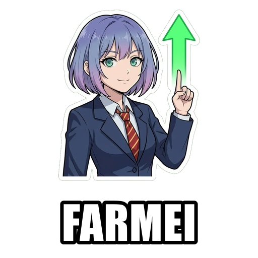
  
  
  
  
  
  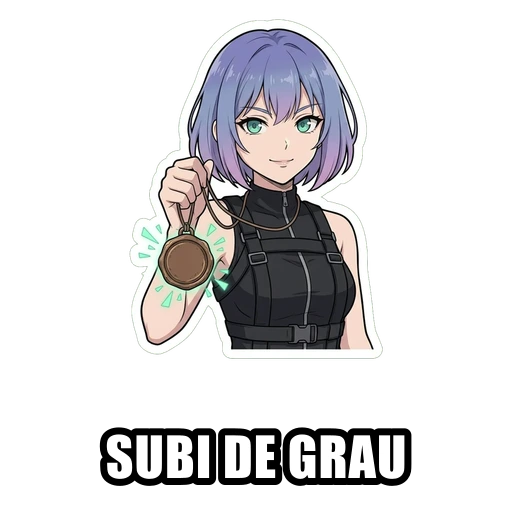
  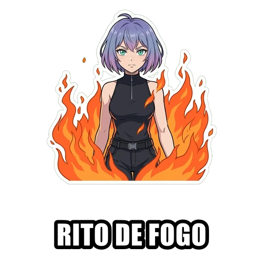
  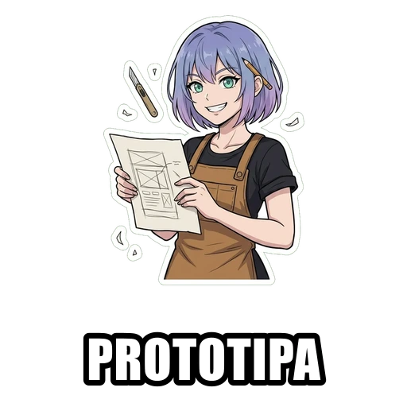
  
  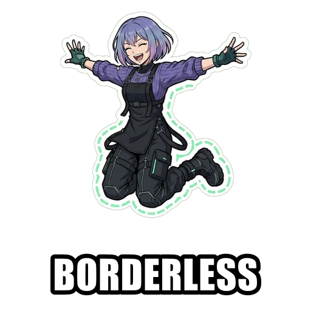
  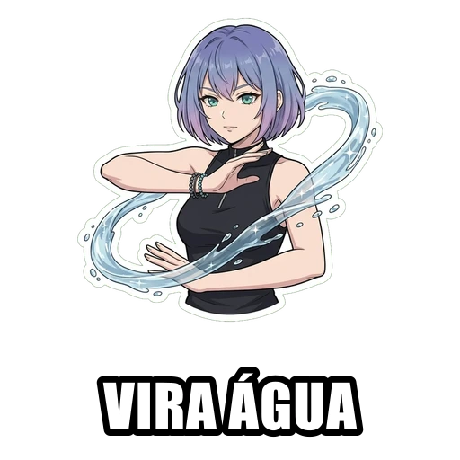
  
  
  
  
  
  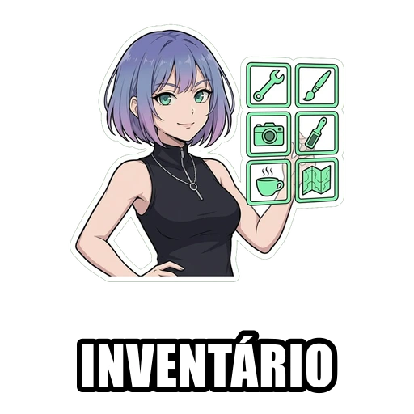
  
  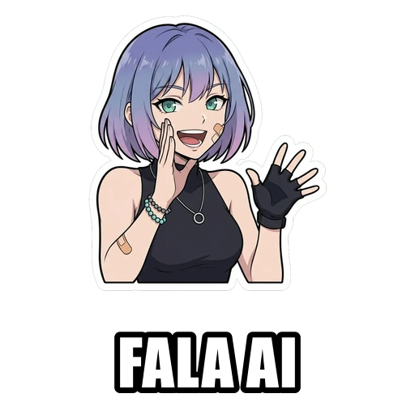
</p>

<details>
<summary><b>The same 45 without text</b> (to caption your own way)</summary>
<br>
<p align="center">
  
  
  
  
  
  
  
  
  
  
  
  
  
  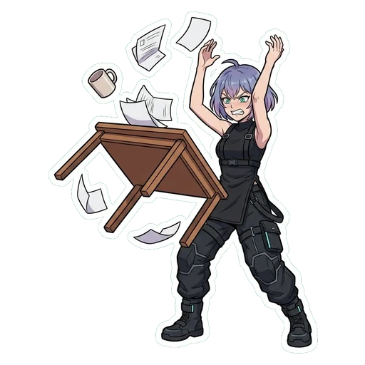
  
  
  
  
  
  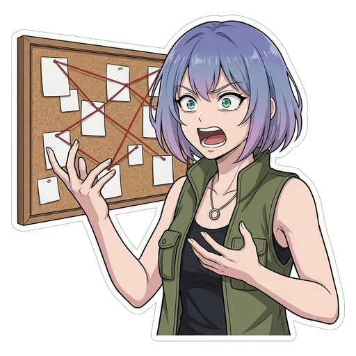
  
  
  
  
  
  
  
  
  
  
  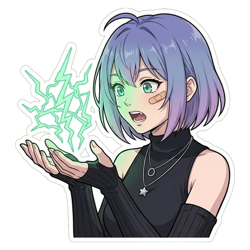
  
  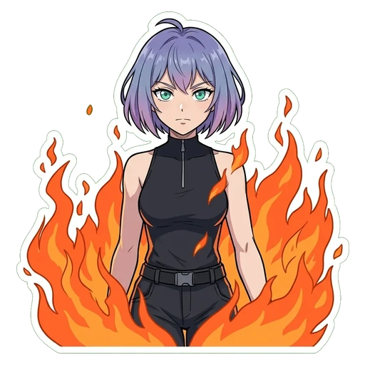
  
  
  
  
  
  
  
  
  
  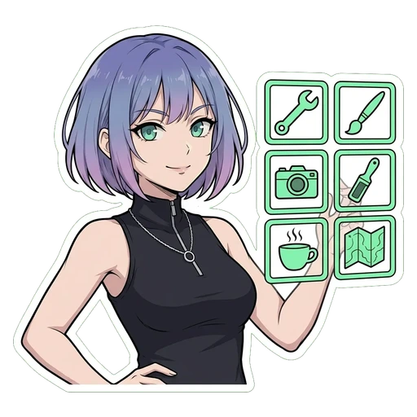
  
  
</p>
</details>

About their style: anime cel-shaded with an ink outline, white die-cut border, flat colors, waist-up framing, caption in Impact drawn in code. The collection also lives at [sapiensinteticos.com/figurinhas](https://www.sapiensinteticos.com/figurinhas), and Helen lives her own day to day at [helenai.wtf](https://helenai.wtf).

## Prefer the machine pre-assembled?

The same recipe runs inside [Sapiens Sintéticos](https://www.sapiensinteticos.com/por-dentro): the character stays locked between generations, the cutout is automatic and the pack shows up in the community chat when it is ready. Doing it freely here or doing it there is your call.

## License

[CC BY 4.0](LICENSE). Use it, remix it, redistribute it, commercially included, just give credit (Sapiens Sintéticos, with a link to [sapiensinteticos.com](https://www.sapiensinteticos.com)).
